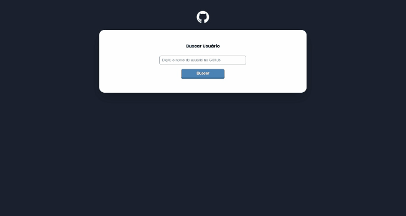

# DevQuest - Desafio: Consumo API GitHub

## Sobre o Desafio 🚀

Neste desafio do curso DevQuest, foi proposto criar uma caixa de busca e o botão para buscar dados de um usuário do github. usando os conhecimentos adquirido na aula de Html, CSS, JS e consumo de API com fecth.

## Layout do App 📄

## Tecnologias Utilizadas 💻

- HTML
- CSS
- JavaScript
- Fetch API

## Funcionalidades do App ✨

No app de busca foram desenvolvido as seguintes funcionalidades:

1. Exibir o nome do Usuário, a foto de perfil, a bio e a quantidade de seguidores/seguindo. Se o usuário não tiver nome será exibido a mensagem 'usuario não possi nome cadastrado', se o usuário não tiver bio será exibido a mensagem 'bio não cadastrada', se o usuário não tiver foto de perfil será exibido a img padrão do github.
2. Exibir os repositorios que o usario possui, se o usario nao possui nenhum repositorio, nao será exibido a secao. Em cada repositorio sera buscado da API GitHub o seu nome, a sua descricao e a quantidade de forks, star, views e a linguagem usada.
3. Exibir os eventos de 'PushEvent' e 'CreateEvent' e descartando os demais eventos. Nos eventos de push será exibido o caminho do repositorio e o ultimo commit realizado, nos eventos de create será exibido a mensagem 'evento do tipo "tipo do evento" não possui commits'
4. O layout se torna responsivos graças as medias queries e ao display flex, juntamente com o flex-grow, flex-basis e flex-shrink.

## Instruções para Execução 🛠️

1. Clone o repositório do projeto em sua máquina local.
2. Abra o arquivo "index.html" em seu navegador de preferência.
3. Faça a busca pos um usuário do GitHub.

## Pagina do projeto

- [Acessar página do projeto](https://etvaldolisboa.github.io/projeto-inicial-fetch-github-api/)